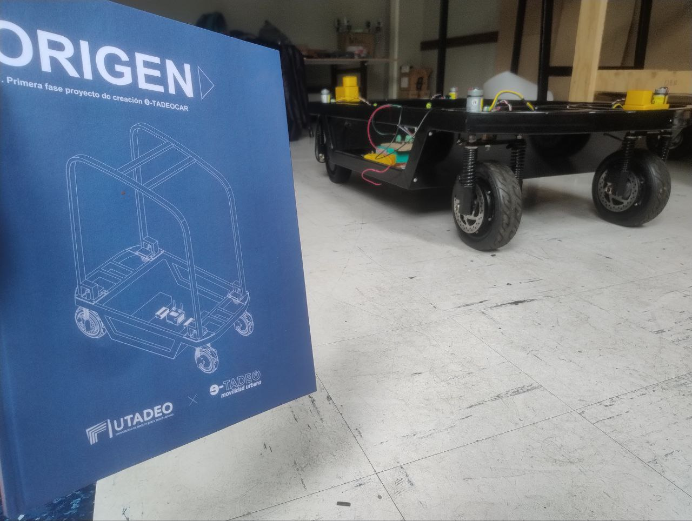
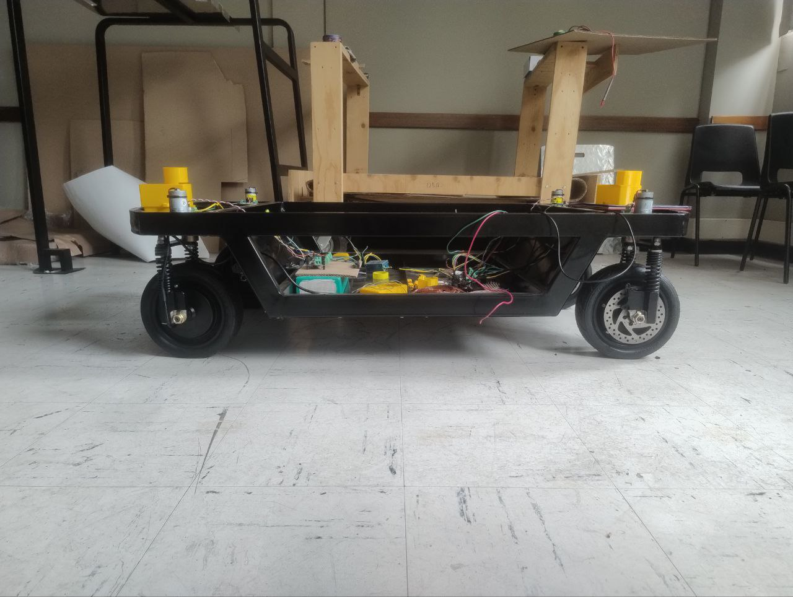
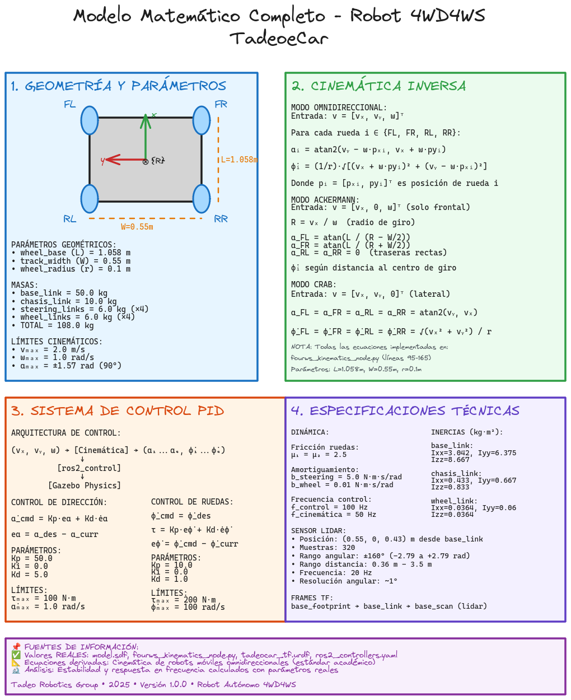

# Robot Autónomo Tadeo eCar 4WD4WS

<div align="center">


[](#)
[](#)
[](#)
[](#)
[](#)
[](#)
[](#)
[](#)
[](https://github.com/MrDavidAlv/Robot4WD4WS)

</div>

> Plataforma robótica autónoma 4WD4WS con navegación autónoma, SLAM, y cinemática omnidireccional usando ROS2 Humble. Diseñada para transporte de materiales en entornos universitarios.

---

## Galería del Robot

<div align="center">
<table>
  <tr>
    <td></td>
    <td></td>
  </tr>
  <tr>
    <td></td>
    <td></td>
  </tr>
</table>
</div>

---

## Arquitectura del Sistema

<div align="center">
<table>
  <tr>
    <th>Transformadas (TF Tree)</th>
    <th>Sistema SLAM</th>
  </tr>
  <tr>
    <td></td>
    <td></td>
  </tr>
  <tr>
    <th>Navegación (Nav2)</th>
    <th>Modelo Matemático</th>
  </tr>
  <tr>
    <td></td>
    <td></td>
  </tr>
</table>
</div>

---

## Paquetes y Launch Files

| Paquete | Launch File | Descripción |
|---------|-------------|-------------|
| `tadeocar_bringup` | `slam_bringup.launch.py` | Simulación completa con SLAM (Gazebo + cinemática + SLAM Toolbox + RViz2) |
| `tadeocar_bringup` | `navigation_bringup.launch.py` | Simulación completa con Nav2 (Gazebo + cinemática + Nav2 + RViz2) |
| `tadeocar_control` | `control.launch.py` | Solo nodo de cinemática 4WS |
| `tadeocar_control` | `fourws_control.launch.py` | Cinemática 4WS con publicación de estado |
| `tadeocar_control` | `xbox_control.launch.py` | Cinemática + control Xbox |
| `tadeocar_description` | `display.launch.py` | Visualización URDF/TF en RViz2 |
| `tadeocar_gazebo` | `simulation.launch.py` | Solo simulación Gazebo Fortress |
| `tadeocar_navigation` | `navigation.launch.py` | Stack Nav2 (AMCL + planificador + DWB) |
| `tadeocar_slam` | `slam.launch.py` | SLAM Toolbox (mapeo async) |
| `tadeocar_slam` | `save_map.launch.py` | Guardar mapa generado |

---

## Instalación

### Dependencias

```bash
sudo apt install -y \
  ros-humble-ros2-control \
  ros-humble-ros2-controllers \
  ros-humble-ros-gz \
  ros-humble-navigation2 \
  ros-humble-nav2-bringup \
  ros-humble-slam-toolbox \
  ros-humble-robot-localization \
  ros-humble-joy \
  ros-humble-teleop-twist-joy \
  ros-humble-rviz2 \
  ros-humble-xacro \
  ros-humble-robot-state-publisher \
  ros-humble-joint-state-publisher

pip3 install websockets numpy
```

### Compilar

```bash
source /opt/ros/humble/setup.bash
colcon build --symlink-install
source install/setup.bash
```

---

## Ejecución

```bash
# Mapeo con SLAM
ros2 launch tadeocar_bringup slam_bringup.launch.py

# Guardar mapa
ros2 launch tadeocar_slam save_map.launch.py

# Navegación autónoma
ros2 launch tadeocar_bringup navigation_bringup.launch.py

# Visualización del modelo
ros2 launch tadeocar_description display.launch.py
```

Los mapas se guardan en `src/tadeocar_navigation/maps/`.

---

<div align="center">
Desarrollado por el Semillero Robotica Utadeo
</div>
