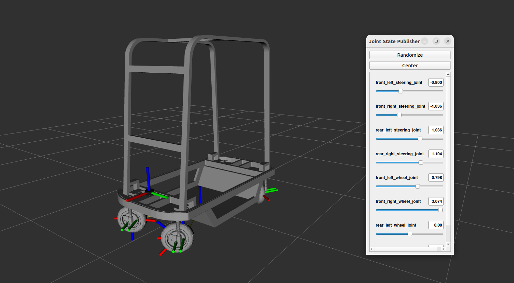
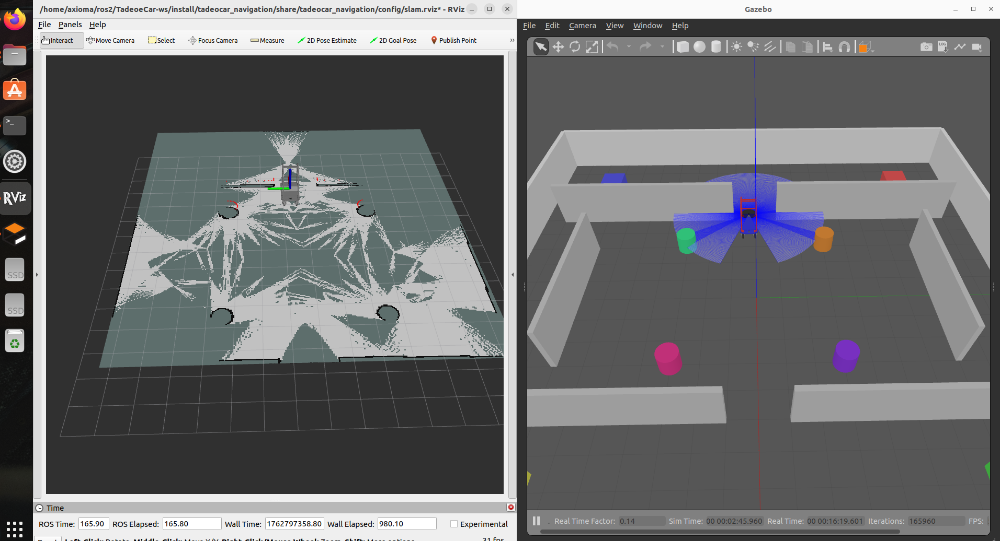
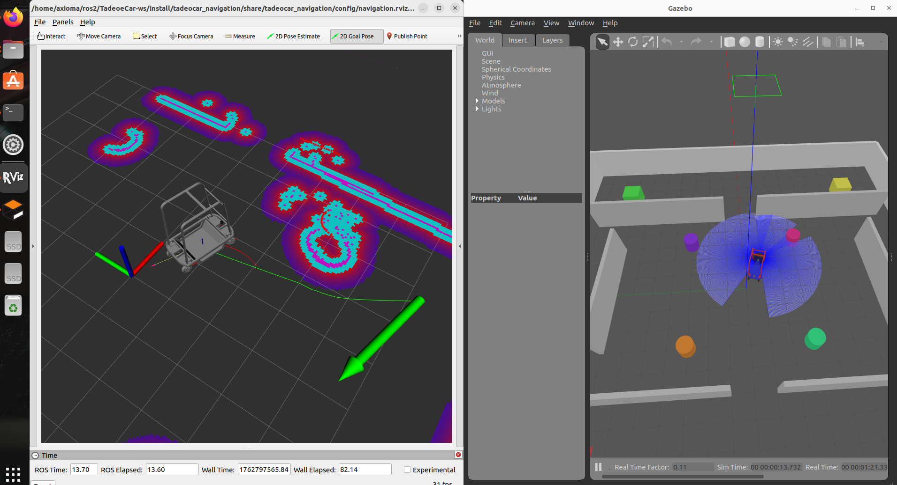

# 🤖 Robot Autónomo Tadeo eCar 4WD4WS

<div align="center">

</div>

[](#)
[](#)
[](#)
[](#)
[](#)
[](#)
[](#)
[](#)
[](#)
[](#)
[](#)
[](#)
[](https://github.com/MrDavidAlv/Robot4WD4WS)

> Plataforma robótica autónoma para logística universitaria en interiores. Robot eléctrico omnidireccional 4WD 4WS con capacidades de navegación autónoma, SLAM, visión computacional y planificación de trayectorias usando ROS2 Humble. Diseñado para transporte de materiales en ambientes universitarios.

---

## 📑 Tabla de Contenidos

- [Características](#-características)
- [Arquitectura del Sistema](#-arquitectura-del-sistema)
- [Requisitos del Sistema](#-requisitos-del-sistema)
- [Instalación](#-instalación)
- [Compilación](#-compilación)
- [Ejecución](#-ejecución)
- [Nodos Principales](#-nodos-principales)
- [Modos de Operación](#-modos-de-operación)
- [Estructura del Proyecto](#-estructura-del-proyecto)

---

## ✨ Características

- **Sistema de tracción 4WD4WS**: Cuatro ruedas motrices y direccionales independientes
- **Control omnidireccional**: Movilidad de 360° con múltiples modos de conducción
- **Navegación autónoma**: Stack completo de Nav2 para planificación y evasión de obstáculos
- **SLAM en tiempo real**: Mapeo y localización simultáneos con SLAM Toolbox
- **Cinemática avanzada**: Control de dirección y velocidad de las cuatro ruedas con modelos Ackermann, Omnidireccional y Crab
- **Control multi-interfaz**: Soporte para Xbox controller, interfaz web y comandos de navegación
- **Simulación completa**: Integración con Gazebo Classic y ros2_control
- **Sensor LiDAR**: Rango de 3.5m, 320 muestras, 20Hz para percepción del entorno

---

## 🏗️ Arquitectura del Sistema

### Transformadas (TF Tree)
<div align="center">

</div>

El árbol de transformadas define las relaciones espaciales entre todos los componentes del robot desde `base_footprint` hasta el sensor LiDAR en `base_scan`.

### Sistema SLAM
<div align="center">

</div>

SLAM Toolbox genera mapas de ocupación en tiempo real procesando datos del LiDAR y odometría, permitiendo localización simultánea en entornos desconocidos.

### Sistema de Navegación
<div align="center">

</div>

Nav2 stack proporciona planificación global con NavFn, control local con DWB, costmaps dinámicos y comportamientos de recuperación para navegación autónoma robusta.

---

## 💻 Requisitos del Sistema

### Software Base
- **Sistema Operativo**: Ubuntu 22.04 LTS (Jammy Jellyfish)
- **ROS2**: Humble Hawksbill
- **Gazebo**: Classic 11
- **Python**: 3.8 o superior
- **CMake**: 3.16 o superior

### Dependencias ROS2

#### Paquetes Core
```bash
ros-humble-ros-base
ros-humble-ros2-control
ros-humble-ros2-controllers
ros-humble-gazebo-ros-pkgs
ros-humble-gazebo-ros2-control
ros-humble-robot-state-publisher
ros-humble-joint-state-publisher
```

#### Navegación y SLAM
```bash
ros-humble-navigation2
ros-humble-nav2-bringup
ros-humble-slam-toolbox
ros-humble-robot-localization
```

#### Control y Teleoperation
```bash
ros-humble-joy
ros-humble-teleop-twist-joy
ros-humble-rviz2
ros-humble-xacro
```

#### Mensajes y Interfaces
```bash
ros-humble-std-msgs
ros-humble-sensor-msgs
ros-humble-geometry-msgs
ros-humble-nav-msgs
ros-humble-tf2-ros
```

### Dependencias Python
```bash
websockets>=10.0
numpy>=1.21.0
```

### Hardware Recomendado
- **CPU**: Intel i5 8th Gen / AMD Ryzen 5 o superior
- **RAM**: 8 GB mínimo, 16 GB recomendado
- **GPU**: NVIDIA con soporte CUDA (opcional, para aceleración)
- **Almacenamiento**: 10 GB libres

---

## 🔧 Instalación

### 1. Instalar ROS2 Humble

```bash
# Configurar locale UTF-8
sudo apt update && sudo apt install locales
sudo locale-gen en_US en_US.UTF-8
sudo update-locale LC_ALL=en_US.UTF-8 LANG=en_US.UTF-8
export LANG=en_US.UTF-8

# Agregar repositorio ROS2
sudo apt install software-properties-common
sudo add-apt-repository universe
sudo apt update && sudo apt install curl -y
sudo curl -sSL https://raw.githubusercontent.com/ros/rosdistro/master/ros.key -o /usr/share/keyrings/ros-archive-keyring.gpg
echo "deb [arch=$(dpkg --print-architecture) signed-by=/usr/share/keyrings/ros-archive-keyring.gpg] http://packages.ros.org/ros2/ubuntu $(. /etc/os-release && echo $UBUNTU_CODENAME) main" | sudo tee /etc/apt/sources.list.d/ros2.list > /dev/null

# Instalar ROS2 Humble
sudo apt update
sudo apt upgrade
sudo apt install ros-humble-desktop
```

### 2. Instalar Dependencias del Proyecto

```bash
# Dependencias ROS2
sudo apt install -y \
  ros-humble-ros2-control \
  ros-humble-ros2-controllers \
  ros-humble-gazebo-ros-pkgs \
  ros-humble-gazebo-ros2-control \
  ros-humble-navigation2 \
  ros-humble-nav2-bringup \
  ros-humble-slam-toolbox \
  ros-humble-robot-localization \
  ros-humble-joy \
  ros-humble-teleop-twist-joy \
  ros-humble-rviz2 \
  ros-humble-xacro \
  ros-humble-robot-state-publisher \
  ros-humble-joint-state-publisher

# Dependencias Python
pip3 install websockets numpy
```

### 3. Clonar el Repositorio

```bash
# Crear workspace
mkdir -p ~/ros2/TadeoeCar-ws
cd ~/ros2/TadeoeCar-ws

# Clonar (o copiar el proyecto existente)
# git clone https://github.com/TadeoRoboticsGroup/tadeo-eCar-ws.git .
```

---

## 🔨 Compilación

### Compilar todos los paquetes

```bash
# Configurar entorno ROS2
source /opt/ros/humble/setup.bash

# Compilar workspace
cd ~/ros2/TadeoeCar-ws
colcon build --symlink-install

# Source el workspace
source install/setup.bash
```

### Compilar paquete específico

```bash
# Compilar solo tadeocar_control
colcon build --packages-select tadeocar_control

# Compilar control y navegación
colcon build --packages-select tadeocar_control tadeocar_navigation
```

### Limpiar build anterior

```bash
rm -rf build/ install/ log/
colcon build --symlink-install
```

---

## 🚀 Ejecución

### Modo SLAM (Mapeo)

Ejecuta simulación completa con Gazebo, control Xbox, cinemática 4WS y SLAM Toolbox para crear mapas:

```bash
source install/setup.bash
ros2 launch tadeocar_bringup slam.launch.py
```

**Componentes lanzados**:
- Gazebo Classic con mundo de prueba
- Nodo de cinemática `fourws_kinematics`
- Nodo de control Xbox `xbox_control`
- SLAM Toolbox (async)
- RViz2 con configuración SLAM

**Control**: Usa Xbox controller con RB para acelerar, joysticks para dirección.

### Guardar Mapa

Una vez completado el mapeo:

```bash
ros2 launch tadeocar_bringup save_map.launch.py
```

Los mapas se guardan en `src/tadeocar_navigation/maps/` como `mapa.pgm` y `mapa.yaml`.

### Modo Navegación Autónoma

Ejecuta navegación autónoma con Nav2 usando un mapa previamente generado:

```bash
source install/setup.bash
ros2 launch tadeocar_bringup navigation.launch.py
```

**Componentes lanzados**:
- Gazebo Classic
- Nodo de cinemática `fourws_kinematics`
- Stack completo de Nav2 (AMCL, planificador, controlador)
- RViz2 con herramientas de navegación

**Uso**: Define `2D Goal Pose` en RViz2 para enviar objetivos de navegación.

### Solo Control y Cinemática

Para desarrollo o pruebas sin SLAM/Nav2:

```bash
# Solo cinemática
ros2 launch tadeocar_control fourws_control.launch.py

# Control Xbox + Cinemática
ros2 launch tadeocar_control xbox_control.launch.py
```

### Visualización con RViz2

```bash
# Visualización de TF y modelo
ros2 launch tadeocar_description display.launch.py

# Visualización SLAM
rviz2 -d src/tadeocar_navigation/config/slam.rviz

# Visualización Navegación
rviz2 -d src/tadeocar_navigation/config/navigation.rviz
```

---

## 🤖 Nodos Principales

### 1. `fourws_kinematics_node`

**Ejecutable**: `fourws_kinematics`
**Paquete**: `tadeocar_control`
**Archivo**: `src/tadeocar_control/tadeocar_control/fourws_kinematics_node.py`

#### Descripción
Nodo de control cinemático para robot 4WD4WS que convierte comandos de velocidad (`Twist`) en comandos de dirección y velocidad angular para cada una de las cuatro ruedas. Compatible con ros2_control y Gazebo Classic.

#### Parámetros del Robot
| Parámetro | Valor | Descripción |
|-----------|-------|-------------|
| `wheel_radius` | 0.1 m | Radio de las ruedas |
| `wheel_base` | 1.058 m | Distancia entre eje delantero y trasero |
| `track_width` | 0.55 m | Distancia entre ruedas izquierda y derecha |
| `max_linear_speed` | 2.0 m/s | Velocidad lineal máxima |
| `max_angular_speed` | 1.0 rad/s | Velocidad angular máxima |
| `max_steering_angle` | 1.57 rad (~90°) | Ángulo de dirección máximo |

#### Control PID
- **Dirección**: `kp=50.0`, `kd=5.0` (control de posición angular)
- **Ruedas**: `kp=10.0`, `kd=1.0` (control de velocidad)

#### Tópicos

**Suscripciones**:
- `/cmd_vel` (`geometry_msgs/Twist`): Comandos de velocidad manuales o Xbox
- `/cmd_vel_nav` (`geometry_msgs/Twist`): Comandos de velocidad de Nav2
- `/robot_mode` (`std_msgs/String`): Cambio de modo de conducción
- `/joint_states` (`sensor_msgs/JointState`): Estado actual de juntas

**Publicaciones** (ros2_control commands):
- `/front_left_steering_controller/commands`
- `/front_right_steering_controller/commands`
- `/rear_left_steering_controller/commands`
- `/rear_right_steering_controller/commands`
- `/front_left_wheel_controller/commands`
- `/front_right_wheel_controller/commands`
- `/rear_left_wheel_controller/commands`
- `/rear_right_wheel_controller/commands`

#### Modos de Operación

1. **Omnidirectional**: Todas las ruedas apuntan en la dirección del vector de movimiento, permitiendo movilidad de 360°
2. **Ackermann**: Dirección tipo automóvil (ruedas delanteras direccionales, traseras fijas)
3. **Crab**: Movimiento lateral (todas las ruedas al mismo ángulo, desplazamiento perpendicular)

#### Algoritmo de Cinemática

**Modo Omnidirectional**:
```python
for wheel in [FL, FR, RL, RR]:
    angle = atan2(vy, vx)
    speed = sqrt(vx² + vy²) / wheel_radius
```

**Modo Ackermann**:
```python
if vx != 0:
    R = vx / wz  # Radio de giro
    angle_front = atan(wheel_base / R)
    angle_rear = 0.0
```

**Modo Crab**:
```python
for wheel in [FL, FR, RL, RR]:
    angle = atan2(vy, vx)
    speed = vy / wheel_radius  # Velocidad lateral constante
```

---

### 2. `xbox_control_node`

**Ejecutable**: `xbox_control`
**Paquete**: `tadeocar_control`
**Archivo**: `src/tadeocar_control/tadeocar_control/xbox_control_node.py`

#### Descripción
Nodo de teleoperación con control Xbox para robot 4WD4WS con soporte de doble joystick para control omnidireccional y crab.

#### Controles Xbox

| Control | Función |
|---------|---------|
| **Joystick Izquierdo** | Dirección de movimiento omnidireccional (X: lateral, Y: frontal) |
| **Joystick Derecho** | Dirección de movimiento crab / rotación |
| **RB (Right Bumper)** | Acelerador (mantener presionado para mover) |
| **LB (Left Bumper)** | Freno de emergencia (parada inmediata) |
| **Botón A** | Cambiar a modo Omnidirectional |
| **Botón B** | Cambiar a modo Ackermann |
| **Botón X** | Cambiar a modo Crab |

#### Parámetros
- `max_linear_speed`: 2.0 m/s
- `max_angular_speed`: 1.0 rad/s
- `deadzone`: 0.1 (zona muerta de joysticks)

#### Tópicos

**Suscripciones**:
- `/joy` (`sensor_msgs/Joy`): Estado del control Xbox

**Publicaciones**:
- `/cmd_vel` (`geometry_msgs/Twist`): Comandos de velocidad
- `/robot_mode` (`std_msgs/String`): Modo de conducción actual

---

### 3. Nodo de Odometría (En Desarrollo)

**Estado**: ⚠️ **TEMPORALMENTE DESHABILITADO**

#### Descripción
Nodo dedicado para cálculo de odometría basado en las cuatro ruedas (`fourws_odometry_node`). Actualmente el sistema utiliza el plugin `diff_drive` de Gazebo como solución temporal, que solo considera las ruedas delanteras.

#### Planificación Futura
El nodo `fourws_odometry` calculará:
- Posición `(x, y, θ)` integrando velocidades de las 4 ruedas
- Velocidades lineales y angulares del robot
- Covarianzas de odometría para fusión con sensores
- Publicación del transform `odom → base_link`

#### Impacto Actual
La odometría diferencial temporal:
- ✅ Funcional para pruebas básicas
- ⚠️ Menos precisa en movimientos omnidireccionales
- ⚠️ No aprovecha las capacidades 4WS completas
- ⚠️ Puede afectar precisión de SLAM y Nav2

**Configuración temporal** en `model.sdf:748-763`:
```xml
<plugin name="diff_drive" filename="libgazebo_ros_diff_drive.so">
  <left_joint>front_left_wheel_joint</left_joint>
  <right_joint>front_right_wheel_joint</right_joint>
  <wheel_separation>0.55</wheel_separation>
  <wheel_diameter>0.2</wheel_diameter>
  <publish_odom>true</publish_odom>
  <publish_odom_tf>true</publish_odom_tf>
  <odometry_frame>odom</odometry_frame>
  <robot_base_frame>base_link</robot_base_frame>
</plugin>
```

---

## 🎮 Modos de Operación

### Omnidirectional Mode
**Características**:
- Movilidad de 360° sin restricciones
- Todas las ruedas apuntan en dirección del movimiento
- Ideal para maniobras en espacios reducidos
- Mayor consumo energético

**Cinemática**: Cada rueda se orienta según `atan2(vy, vx)` y gira a velocidad proporcional a `sqrt(vx² + vy²)`.

### Ackermann Mode
**Características**:
- Comportamiento tipo automóvil
- Ruedas delanteras direccionales, traseras fijas
- Menor desgaste de neumáticos
- Eficiente en trayectorias largas

**Cinemática**: Ángulos de dirección calculados según geometría Ackermann con radio de giro `R = vx / wz`.

### Crab Mode
**Características**:
- Movimiento lateral puro
- Todas las ruedas al mismo ángulo
- Desplazamiento perpendicular al chasis
- Útil para alineación precisa

**Cinemática**: Ángulo constante para todas las ruedas, velocidad uniforme basada en `vy`.

---

## 📂 Estructura del Proyecto

```
TadeoeCar-ws/
├── src/
│   ├── tadeocar_control/          # Control y cinemática
│   │   ├── tadeocar_control/
│   │   │   ├── fourws_kinematics_node.py  ⭐ Cinemática 4WS
│   │   │   ├── xbox_control_node.py       ⭐ Control Xbox
│   │   │   └── web_control_node.py        WebSocket control
│   │   ├── config/
│   │   │   └── ros2_controllers.yaml      Configuración ros2_control
│   │   ├── launch/
│   │   └── package.xml
│   │
│   ├── tadeocar_navigation/       # SLAM y Nav2
│   │   ├── config/
│   │   │   ├── nav2_params.yaml           Parámetros Nav2
│   │   │   ├── slam_params.yaml           Parámetros SLAM Toolbox
│   │   │   ├── navigation.rviz
│   │   │   └── slam.rviz
│   │   ├── launch/
│   │   │   └── slam.launch.py
│   │   ├── maps/
│   │   │   ├── mapa.pgm
│   │   │   └── mapa.yaml
│   │   └── package.xml
│   │
│   ├── tadeocar_description/      # Modelo del robot
│   │   ├── models/tadeocar_v1/
│   │   │   └── model.sdf                  Modelo Gazebo SDF
│   │   ├── urdf/
│   │   │   └── tadeocar_tf.urdf           Definición TF
│   │   ├── meshes/                        Modelos 3D (DAE)
│   │   ├── worlds/                        Mundos Gazebo
│   │   └── package.xml
│   │
│   └── tadeocar_bringup/          # Launch files principales
│       ├── launch/
│       │   ├── slam.launch.py             ⭐ SLAM completo
│       │   ├── navigation.launch.py       ⭐ Navegación autónoma
│       │   └── save_map.launch.py         Guardar mapas
│       └── package.xml
│
├── images/                         # Documentación visual
│   ├── portada.png
│   ├── Navigation.png
│   ├── SLAM.png
│   └── URDF-TF.png
│
└── README.md
```

---

## 🔍 Flujo de Datos del Sistema

### Control Manual
```
Xbox Controller → joy_node → /joy
    ↓
xbox_control_node → /cmd_vel (Twist)
    ↓
fourws_kinematics_node → ros2_control commands
    ↓
Gazebo + ros2_control → Simulación física
    ↓
joint_state_broadcaster → /joint_states
```

### SLAM
```
Gazebo Lidar Plugin → /scan (LaserScan)
    ↓
slam_toolbox → /map (OccupancyGrid) + TF (map → odom)
    ↓
RViz2 (Visualización)
```

### Navegación Autónoma
```
/goal_pose (Nav2 RViz) → nav2_planner
    ↓
nav2_controller → /cmd_vel_nav (Twist)
    ↓
fourws_kinematics_node (modo crab) → ros2_control
    ↓
Gazebo → Ejecución del plan
```

---

## 🐛 Problemas Conocidos

### 1. Odometría Temporal (Alta prioridad)
**Descripción**: Se usa plugin `diff_drive` en lugar de nodo dedicado `fourws_odometry_node`.
**Impacto**: Odometría menos precisa en movimientos omnidireccionales.
**Estado**: En desarrollo.

### 2. Configuración Nav2 para Diferencial
**Descripción**: `nav2_params.yaml` usa `DifferentialMotionModel` en AMCL.
**Solución**: Cambiar a modelo holonómico/omnidireccional.
**Impacto**: Localización subóptima en movimientos laterales.

### 3. SLAM no optimizado para 4WS
**Descripción**: Parámetros de SLAM Toolbox balanceados para diff_drive.
**Solución**: Re-tunear parámetros para odometría 4WS.
**Impacto**: Menor precisión en mapeo con movimientos complejos.

---

## 📝 Notas Adicionales

### Configuración ros2_control
El sistema utiliza **JointGroupVelocityController** para control PID de velocidad en cada junta:
- **Steering joints**: Controladores de posición con retroalimentación de velocidad (`kp=50.0`)
- **Wheel joints**: Controladores de velocidad directa (`kp=10.0`)
- **Update rate**: 100 Hz

### Sensor LiDAR (Ray Sensor)
- **Modelo**: `gpu_ray` en Gazebo
- **Muestras**: 320
- **Rango angular**: ±160° (-2.79 a +2.79 rad)
- **Rango de distancia**: 0.36 m - 3.5 m
- **Frecuencia**: 20 Hz
- **Ruido**: Media 0.0, desviación estándar 0.01

### Parámetros Físicos del Robot
| Parámetro | Valor |
|-----------|-------|
| **Masa total** | ~90 kg (chasis: 50kg, suspensiones: 24kg, ruedas: 24kg) |
| **Dimensiones** | 1.058m (L) × 0.55m (W) × ~0.5m (H) |
| **Coeficiente de fricción** | μ₁=2.5, μ₂=2.5 (ruedas) |
| **Amortiguación steering** | 5.0 N·m·s/rad |
| **Amortiguación wheels** | 0.01 N·m·s/rad |

---

## 📞 Contacto y Soporte

**Organización**: Tadeo Robotics Group
**Repositorio**: [github.com/TadeoRoboticsGroup/tadeo-eCar-ws](https://github.com/TadeoRoboticsGroup/tadeo-eCar-ws)
**Licencia**: Privada

---

## 🔄 Comandos Rápidos

```bash
# Setup completo
source /opt/ros/humble/setup.bash
cd ~/ros2/TadeoeCar-ws
colcon build --symlink-install
source install/setup.bash

# Ejecutar SLAM
ros2 launch tadeocar_bringup slam.launch.py

# Ejecutar navegación
ros2 launch tadeocar_bringup navigation.launch.py

# Verificar nodos activos
ros2 node list

# Ver tópicos
ros2 topic list

# Monitorear cmd_vel
ros2 topic echo /cmd_vel

# Ver TF tree
ros2 run tf2_tools view_frames
```

---

<div align="center">
Desarrollado con ❤️ por Tadeo Robotics Group
</div>
