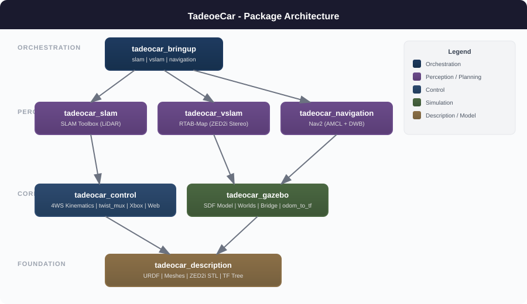
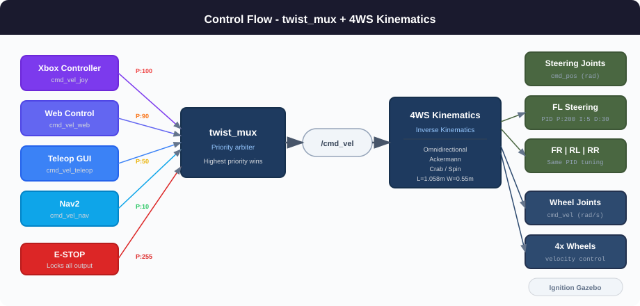
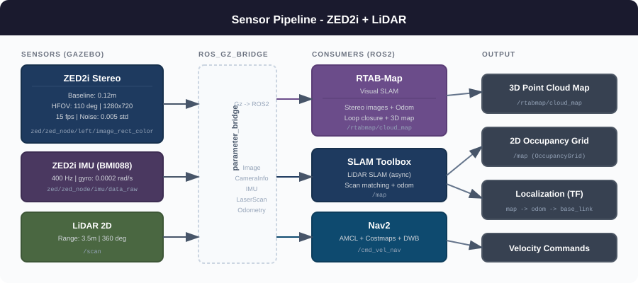
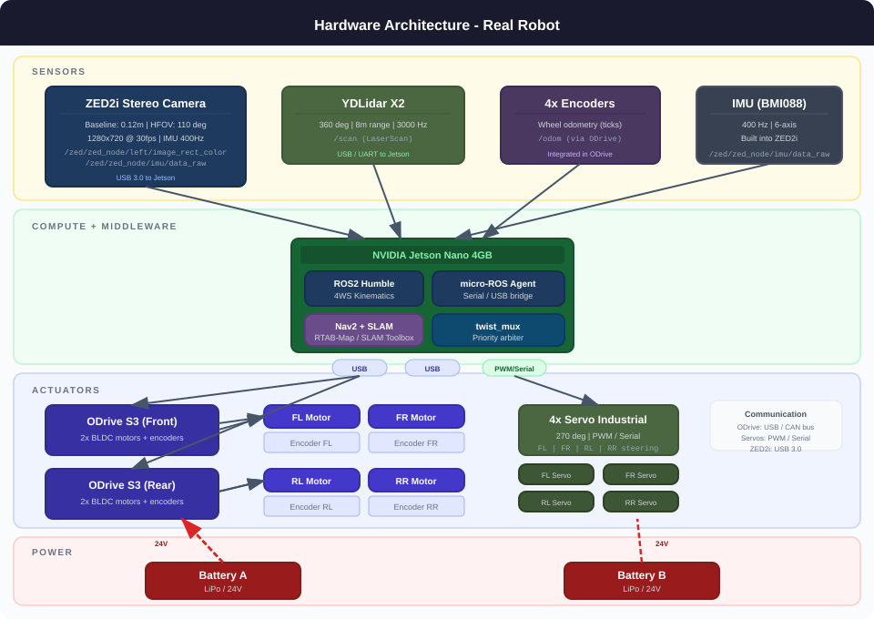
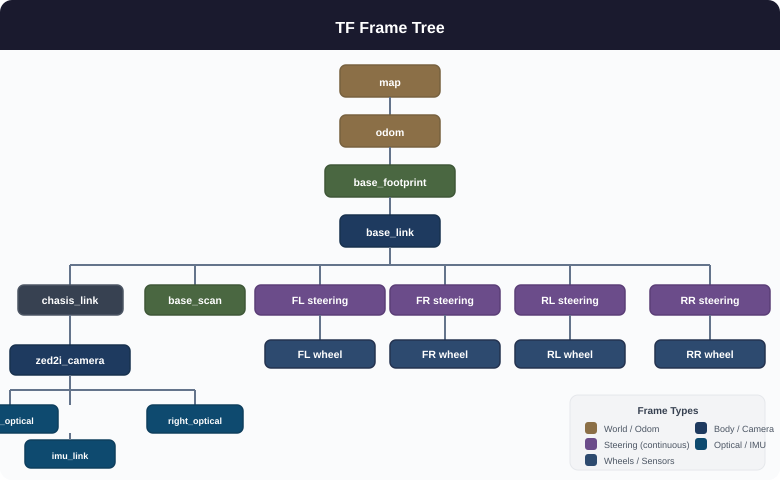
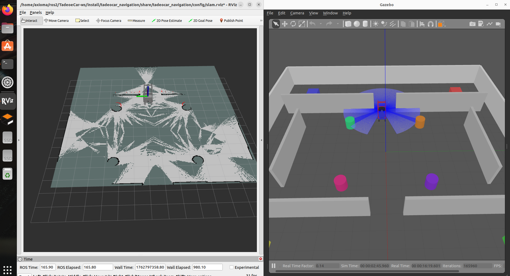
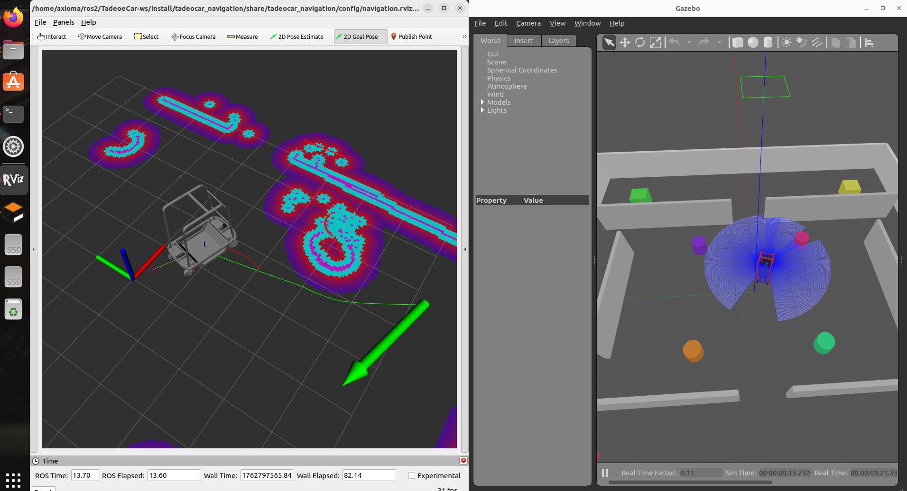

# Tadeo eCar 4WD4WS Autonomous Robot

<div align="center">


[](#)
[](#)
[](#)
[](#)
[](#)
[](#)

</div>

> Autonomous 4WD4WS robotic platform with LiDAR SLAM, Visual SLAM (RTAB-Map + ZED2i), and omnidirectional kinematics. Built on ROS2 Humble for indoor material transport.

---

## Robot

<div align="center">
<table>
  <tr>
    <td></td>
    <td></td>
  </tr>
  <tr>
    <td></td>
    <td></td>
  </tr>
</table>
</div>

---

## Package Architecture

<div align="center">

</div>

---

## Control Flow

<div align="center">

</div>

---

## Sensor Pipeline

<div align="center">

</div>

---

## Hardware Architecture (Real Robot)

<div align="center">

</div>

---

## TF Frame Tree

<div align="center">

</div>

---

## Simulation Screenshots

<div align="center">
<table>
  <tr>
    <th>SLAM</th>
    <th>Navigation</th>
  </tr>
  <tr>
    <td></td>
    <td></td>
  </tr>
</table>
</div>

---

## Specifications

| Parameter | Simulation | Real Robot |
|-----------|-----------|------------|
| Wheelbase | 1.058 m | 1.058 m |
| Track width | 0.55 m | 0.55 m |
| Steering | 4WS | 4x Industrial servos 270 deg |
| Drive | 4WD | 4x BLDC (2x ODrive S3) |
| Compute | Host PC | Jetson Nano 4GB |
| Camera | ZED2i (simulated) | ZED2i (USB 3.0) |
| LiDAR | 2D, 360 deg, 3.5m | YDLidar X2 (8m) |
| Power | N/A | 2x LiPo 24V |

---

## Installation

```bash
# Dependencies
sudo apt install -y \
  ros-humble-ros-gz ros-humble-navigation2 ros-humble-nav2-bringup \
  ros-humble-slam-toolbox ros-humble-rtabmap-ros ros-humble-twist-mux \
  ros-humble-joy ros-humble-teleop-twist-joy ros-humble-rviz2 \
  ros-humble-xacro ros-humble-robot-state-publisher

pip3 install websockets numpy

# Build
source /opt/ros/humble/setup.bash
colcon build --symlink-install
source install/setup.bash
```

---

## Usage

```bash
# LiDAR SLAM
ros2 launch tadeocar_bringup slam_bringup.launch.py

# Visual SLAM (RTAB-Map + ZED2i)
ros2 launch tadeocar_bringup vslam_bringup.launch.py

# Autonomous navigation
ros2 launch tadeocar_bringup navigation_bringup.launch.py

# Xbox controller
ros2 launch tadeocar_control xbox_control.launch.py

# Save map
ros2 launch tadeocar_slam save_map.launch.py
```

---

## Documentation

Technical documentation and mathematical model in [documentacion/](documentacion/).

---

<div align="center">
Semillero de Robotica - Universidad de Bogota Jorge Tadeo Lozano
</div>
