# TadeoeCar — 4WD4WS Autonomous Mobile Robot

<div align="center">
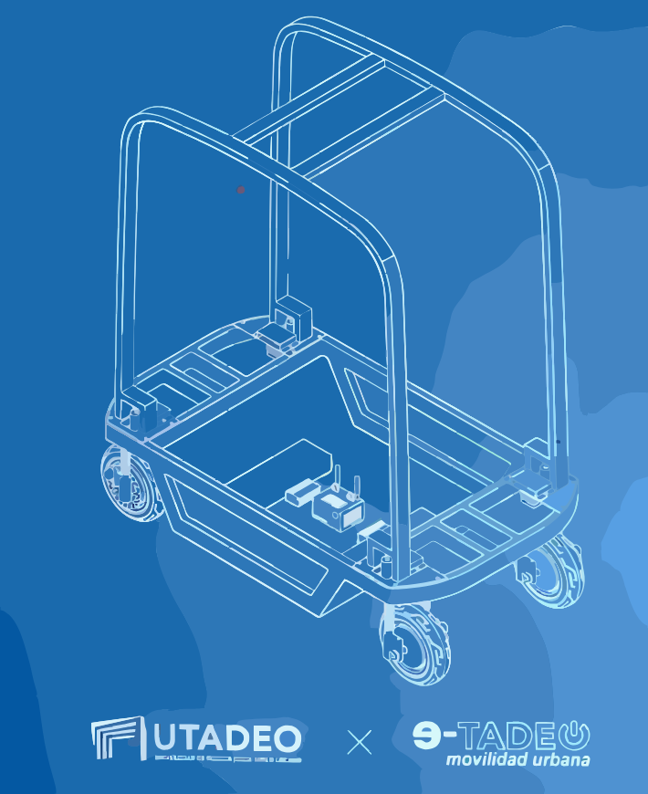

[](#)
[](#)
[](#)
[](#)
[](#)
[](#)
[](LICENSE)

</div>

> A four wheel drive, four wheel steering electric platform for indoor and yard
> material transport. Every wheel drives and every wheel steers, so the robot
> can follow a car-like path, spin on the spot, or crab sideways without
> changing heading. Built on ROS 2 Humble and Ignition Gazebo Fortress, with a
> ZED 2i stereo camera, a YDLIDAR X2, and an estimator that knows the ground is
> not always flat.

---

## Quick start

```bash
# 1. Dependencies (Ubuntu 22.04 with ROS 2 Humble already installed)
sudo apt install -y ros-humble-ros-gz ros-humble-navigation2 \
  ros-humble-nav2-bringup ros-humble-slam-toolbox ros-humble-rtabmap-ros \
  ros-humble-robot-localization ros-humble-twist-mux ros-humble-joy \
  ros-humble-teleop-twist-joy ros-humble-xacro ros-humble-rviz2
pip3 install numpy websockets

# 2. Build
source /opt/ros/humble/setup.bash
colcon build --symlink-install && source install/setup.bash

# 3. Drive it
ros2 launch tadeocar_bringup demo.launch.py

# Or map with the LiDAR
ros2 launch tadeocar_bringup slam_bringup.launch.py

# Or navigate autonomously
ros2 launch tadeocar_bringup navigation_bringup.launch.py

# Or build a 3D map with the camera
ros2 launch tadeocar_bringup vslam_bringup.launch.py
```

Full instructions: [docs/installation-guide.md](docs/installation-guide.md) ·
[docs/usage-guide.md](docs/usage-guide.md)

---

## Contents

- [The robot](#the-robot)
- [What makes 4WD4WS different](#what-makes-4wd4ws-different)
- [Simulation environments](#simulation-environments)
- [System architecture](#system-architecture)
- [Attitude-aware localisation](#attitude-aware-localisation)
- [LiDAR SLAM](#lidar-slam)
- [Autonomous navigation](#autonomous-navigation)
- [RGB-D visual SLAM](#rgb-d-visual-slam)
- [Mathematical model](#mathematical-model)
- [Specifications](#specifications)
- [Project structure](#project-structure)
- [Documentation](#documentation)

---

## The robot

A low flatbed on four independently steered wheels with coil-over suspension,
built by the robotics research group at Universidad de Bogotá Jorge Tadeo
Lozano.

<div align="center">
<table>
  <tr>
    <td>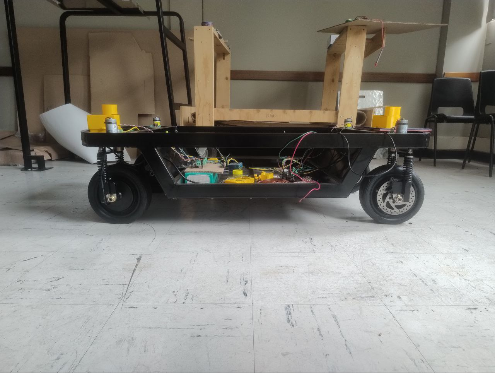</td>
    <td>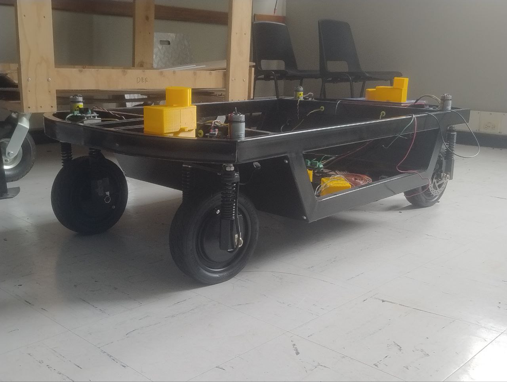</td>
  </tr>
  <tr>
    <td>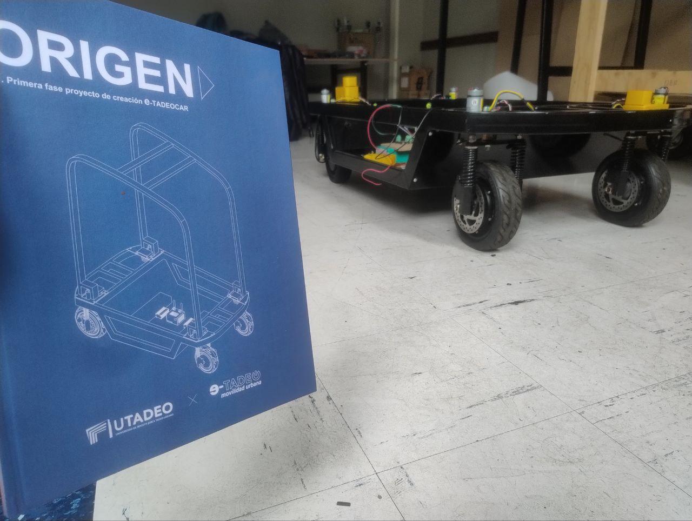</td>
    <td>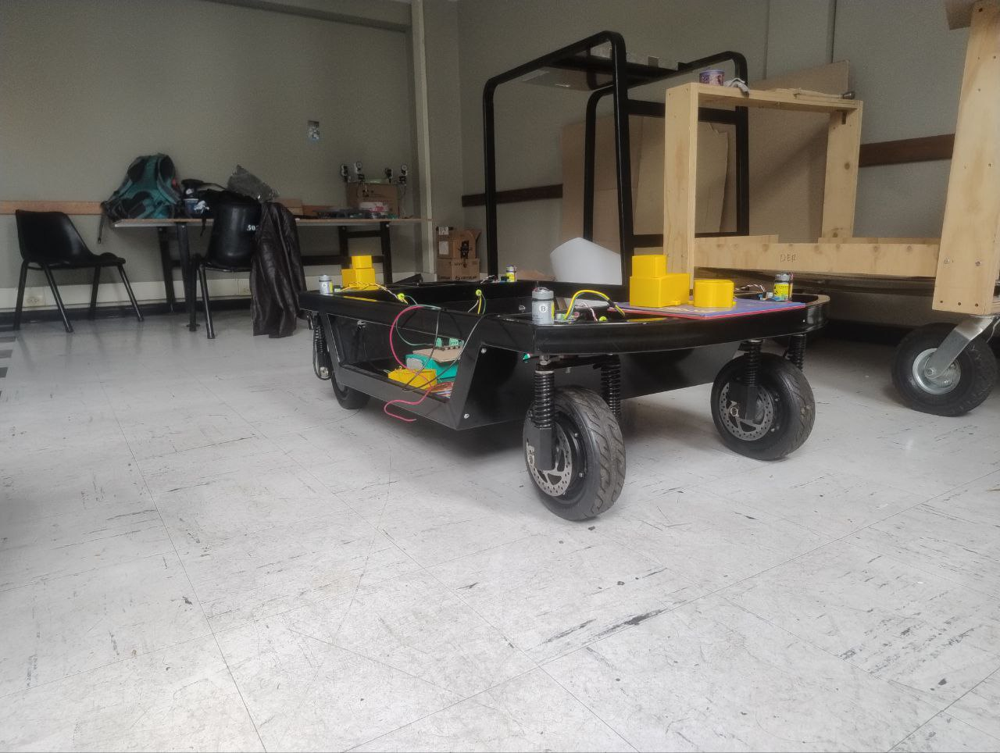</td>
  </tr>
</table>
</div>

And the same machine in simulation, with the LiDAR on its mast and the ZED 2i
on the front bumper:

<div align="center">
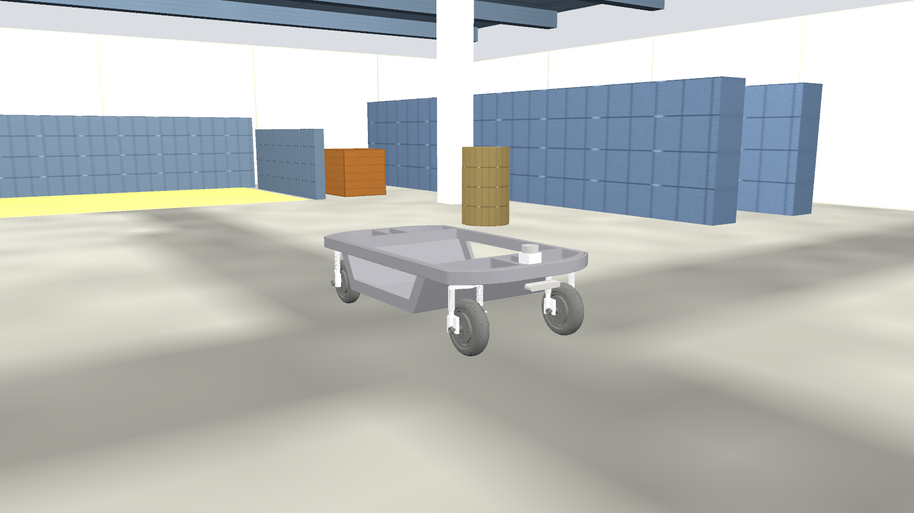
</div>

---

## What makes 4WD4WS different

Most mobile robot software assumes one of two things: that the wheels are
fixed and the robot turns by driving them at different speeds, or that the
wheels roll in two directions at once. Neither is true here.

The TadeoeCar steers conventional tyres. Sideways motion comes from *pointing*
four wheels, not from rolling sideways, and pointing them takes about half a
second for a 90 degree change. That single fact shapes the whole stack:

- The controller **gates wheel torque on steering error**, so a wheel is not
  dragged sideways while its servo is still swinging.
- The path follower is **Regulated Pure Pursuit rather than DWB**, because a
  sampling controller scores trajectories the robot cannot execute yet.
- The odometry is an **overdetermined least-squares fit** over four wheels
  rather than a closed form over two.

Three driving modes are available on `/robot_mode`:

| Mode | Behaviour | Used for |
|---|---|---|
| `omnidirectional` | every wheel points along its own velocity | the default; any body twist, exactly |
| `ackermann` | front wheels steer, rear stay straight | paths a car could also follow |
| `crab` | all four wheels at one angle | translate without turning, heading held by a closed loop |

---

## Simulation environments

Two worlds, and neither is hand-written. Each is emitted by a Python script
that produces the Gazebo world **and** the Nav2 occupancy grid from the same
list of primitives, so the map and the building cannot disagree.

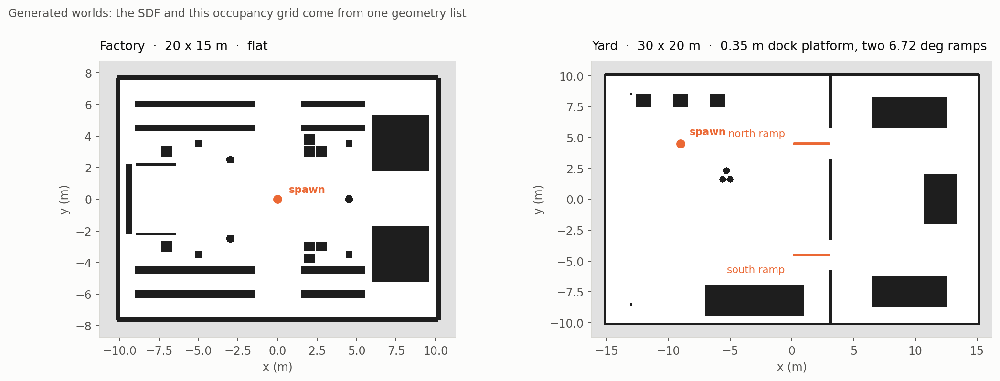

<div align="center">
<table>
  <tr>
    <td>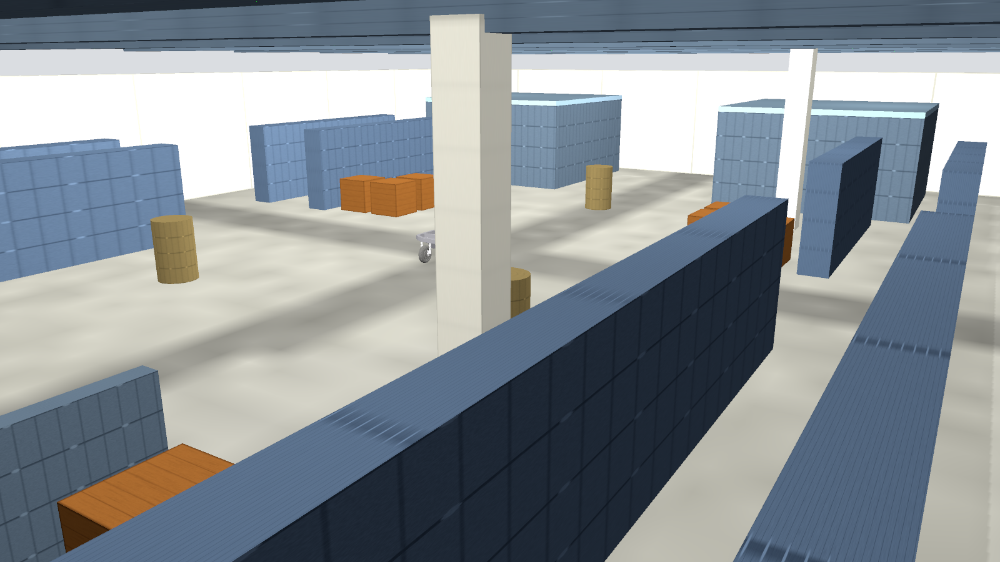</td>
    <td>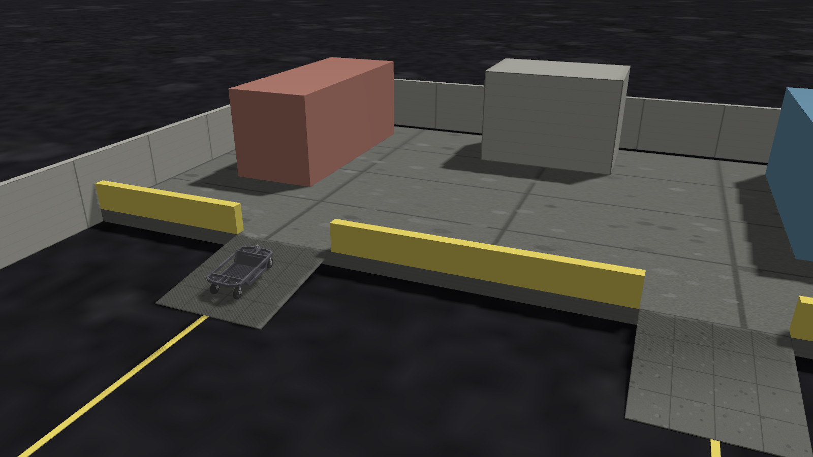</td>
  </tr>
  <tr>
    <td align="center"><i>Factory: racks, pillars, roof trusses, bay lighting</i></td>
    <td align="center"><i>Yard: the dock platform and both ramps, seen from the apron</i></td>
  </tr>
</table>
</div>

**Factory** — 20 × 15 m of warehouse: rack rows, machinery, pillars, crates,
a loading bay. Flat, textured, roofed. This is where planning and mapping are
judged.

**Yard** — 30 × 20 m of outdoor apron with a 0.35 m dock platform reached by
two 6.72° ramps forming a closed loop, and an apron split into asphalt
(μ 0.90), gravel (μ 0.55) and sand (μ 0.30) patches carrying genuinely
different friction. This world exists to break two assumptions the rest of the
stack makes: that the ground is flat, and that friction is a constant.

The generators refuse to emit a world whose layout is unusable — a blocked
corridor, two models sharing space, or an obstacle in the **blind band**
between wheel height (0.125 m) and the LiDAR plane (0.450 m), where a thing
exists in the physics and in no sensor.

---

## System architecture

### Packages

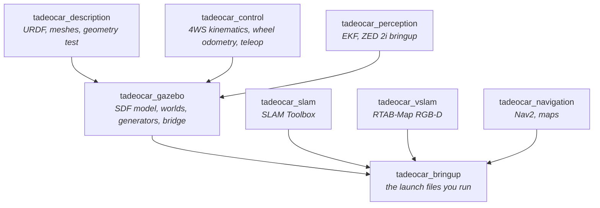
```mermaid
flowchart TD
    D["tadeocar_description<br/><i>URDF, meshes, geometry test</i>"]
    G["tadeocar_gazebo<br/><i>SDF model, worlds, generators, bridge</i>"]
    C["tadeocar_control<br/><i>4WS kinematics, wheel odometry, teleop</i>"]
    P["tadeocar_perception<br/><i>EKF, ZED 2i bringup</i>"]
    S["tadeocar_slam<br/><i>SLAM Toolbox</i>"]
    V["tadeocar_vslam<br/><i>RTAB-Map RGB-D</i>"]
    N["tadeocar_navigation<br/><i>Nav2, maps</i>"]
    B["tadeocar_bringup<br/><i>the launch files you run</i>"]

    D --> G
    G --> B
    C --> G
    P --> G
    S --> B
    V --> B
    N --> B
```

### Data flow

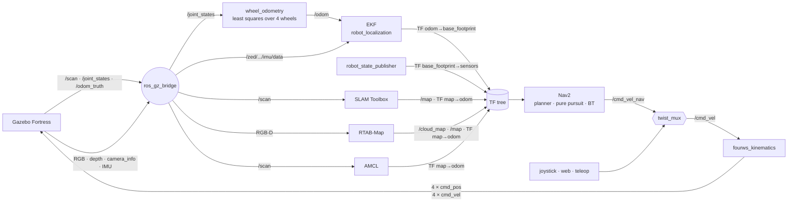
```mermaid
flowchart LR
    GZ["Gazebo Fortress"] -- "/scan · /joint_states · /odom_truth" --> BR(("ros_gz_bridge"))
    GZ -- "RGB · depth · camera_info · IMU" --> BR

    BR -- "/joint_states" --> WO["wheel_odometry<br/>least squares over 4 wheels"]
    WO -- "/odom" --> EKF["EKF<br/>robot_localization"]
    BR -- "/zed/.../imu/data" --> EKF
    EKF -- "TF odom→base_footprint" --> TF[("TF tree")]
    RSP["robot_state_publisher"] -- "TF base_footprint→sensors" --> TF

    BR -- "/scan" --> SLAM["SLAM Toolbox"]
    SLAM -- "/map · TF map→odom" --> TF
    BR -- "RGB-D" --> RTAB["RTAB-Map"]
    RTAB -- "/cloud_map · /map · TF map→odom" --> TF
    BR -- "/scan" --> AMCL["AMCL"]
    AMCL -- "TF map→odom" --> TF

    TF --> NAV["Nav2<br/>planner · pure pursuit · BT"]
    NAV -- "/cmd_vel_nav" --> MUX{{"twist_mux"}}
    JOY["joystick · web · teleop"] --> MUX
    MUX -- "/cmd_vel" --> KIN["fourws_kinematics"]
    KIN -- "4 × cmd_pos<br/>4 × cmd_vel" --> GZ
```

SLAM Toolbox, AMCL and RTAB-Map all publish `map → odom`, but never at the same
time: mapping, navigation and visual SLAM are separate launches.

### Transform tree

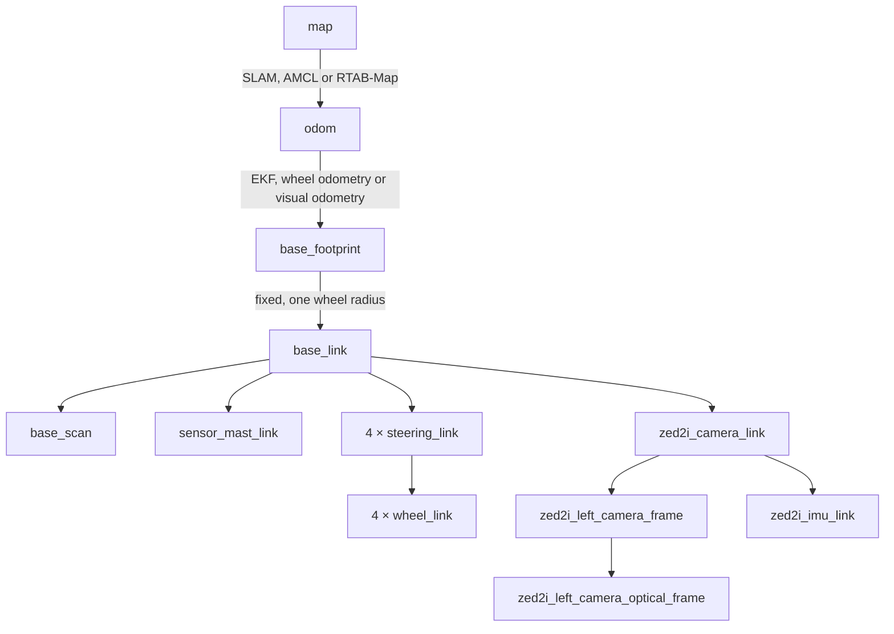
```mermaid
graph TD
    map -->|"SLAM, AMCL or RTAB-Map"| odom
    odom -->|"EKF, wheel odometry or visual odometry"| base_footprint
    base_footprint -->|"fixed, one wheel radius"| base_link
    base_link --> base_scan
    base_link --> sensor_mast_link
    base_link --> steering["4 × steering_link"]
    steering --> wheels["4 × wheel_link"]
    base_link --> zed2i_camera_link
    zed2i_camera_link --> zed2i_left_camera_frame
    zed2i_left_camera_frame --> zed2i_left_camera_optical_frame
    zed2i_camera_link --> zed2i_imu_link
```

`odom → base_footprint` has exactly **one** publisher, chosen by the
`odom_source` argument. A frame gets one parent, and two publishers of one
transform is a broken tree, not a merged one.

---

## Attitude-aware localisation

Wheel odometry solves a planar problem. It takes four wheel speeds and four
steering angles and returns a velocity in the ground plane, because that is all
those sensors can support: an encoder measures rotation, and rotation says how
far the tyre rolled, not which way "along the ground" was pointing at the time.

Drive the yard world's ramp and the consequence is exact rather than
approximate.

<div align="center">
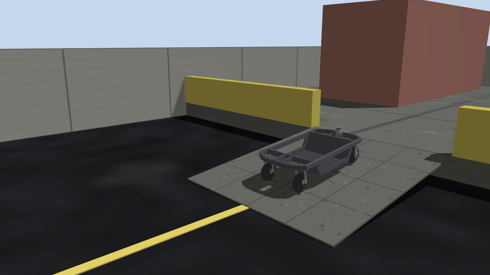
</div>

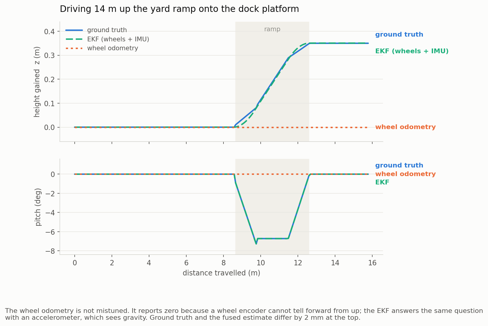

| | ground truth | wheel odometry | EKF |
|---|---|---|---|
| height on the dock platform | 0.350 m | **0.000 m** | 0.352 m |
| pitch, mid-ramp | −6.72° | 0.00° | −6.72° |

The EKF in `tadeocar_perception` fuses the ZED 2i's IMU with the wheels'
velocity. Attitude comes from gravity — an accelerometer at rest knows which
way is down — so the filter integrates the wheels' speed through the attitude
the IMU measures rather than through an assumed-flat world.

Absolute yaw is fused from nothing at all: this robot has no magnetometer, and
the simulated IMU's orientation is ground truth in disguise, so fusing it would
make the simulation look better than the hardware can ever be. Heading drifts,
exactly as it will on the real robot, and correcting it is SLAM's job one level
up.

See it for yourself:

```bash
ros2 launch tadeocar_bringup demo.launch.py                # fused
ros2 launch tadeocar_bringup demo.launch.py use_ekf:=false # dead reckoning
```

---

## LiDAR SLAM

```bash
ros2 launch tadeocar_bringup slam_bringup.launch.py
```

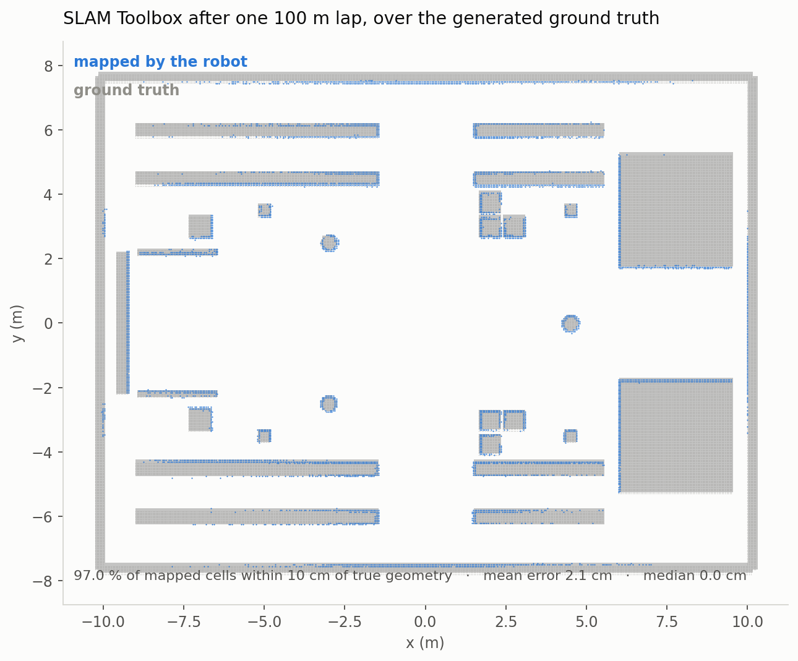

Because the world is generated, the occupancy grid it emits is not an
approximation of the building — it *is* the building, rasterised at 5 cm. That
turns "does the map look right" into a measurement.

| Metric | Result |
|---|---|
| Mapped cells within 10 cm of true geometry | **97.0 %** |
| Mean error | 2.1 cm |
| Median error | 0.0 cm |
| Fused pose after a 100 m lap | 0.55 m, 0.6° |
| Wheel odometry after the same lap | 5.2 m, 21° |

Method and caveats: [docs/slam-validation.md](docs/slam-validation.md).

---

## Autonomous navigation

```bash
ros2 launch tadeocar_bringup navigation_bringup.launch.py
```

Nav2 with **Regulated Pure Pursuit** as the local controller. Five goals across
the factory, scored against ground truth on arrival:

| Goal | Time | Position error | Heading error |
|---|---|---|---|
| (6.0, 0.0) | 11.0 s | 21.8 cm | 9.2° |
| (8.5, 0.0) | 6.7 s | 24.2 cm | 7.5° |
| (0.0, −5.0) | 21.9 s | 30.1 cm | 8.1° |
| (−6.0, 0.0) | 11.4 s | 32.0 cm | 11.1° |
| (0.0, 0.0) | 13.0 s | 22.4 cm | 1.3° |

**5 of 5 reached.** Localisation error while driving: 26.5 cm mean, 50 cm worst.

DWB was tried first and does not suit this platform: it settled into commanding
±0.09 rad/s on alternate cycles with the wheels parked at −60°, and the robot
vibrated in place until the progress checker aborted the goal. The reasoning is
in [docs/mathematical-model/control.md](docs/mathematical-model/control.md) §4.

---

## RGB-D visual SLAM

```bash
ros2 launch tadeocar_bringup vslam_bringup.launch.py
```

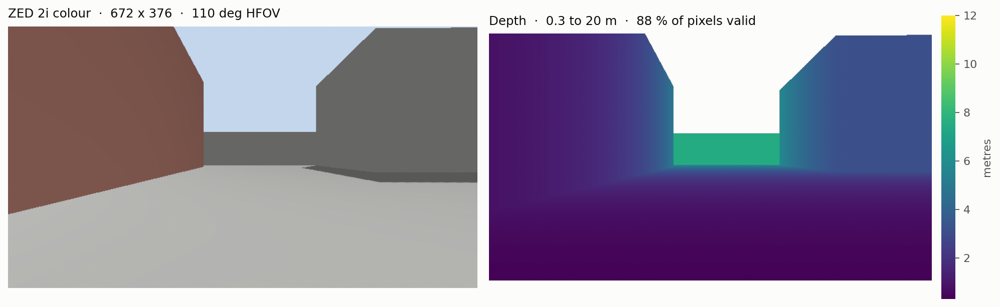

RTAB-Map on the ZED 2i's RGB-D stream, with **camera-only odometry**: nothing
but the images decides where the robot is.

| Metric | Result over a 45 m lap |
|---|---|
| Final pose error | 0.37 m, 0.9° |
| Failed registrations | 1 in 400 frames |
| Feature inliers | median 211, peak 683 |
| Accumulated 3D cloud | 116 865 points |

The first version of this tracked nothing — 13 % of frames failed registration
and the estimate ended 18 m out — and no amount of RTAB-Map tuning moved it.
The cause was that the worlds were rendering **flat-shaded**: Gazebo resolves a
relative texture URI against the directory of the file that names it, not
against `GZ_SIM_RESOURCE_PATH`, so every `albedo_map` in the world silently
failed to load. A corner detector needs intensity gradients, and a flat-shaded
box has none anywhere except its silhouette. Fixing the path, roofing and
lighting the building, and emitting long walls as 2.5 m panels took the inlier
count from 53–65 to a median of 211.

The ZED is simulated as a single `rgbd_camera` at 672 × 376, the camera's own
VGA mode. Its point cloud is **reprojected from the depth image through
`camera_info`** rather than bridged from Gazebo: gz-sensors emits its cloud in
the sensor's body axes while `camera_info` is optical, and one `gz_frame_id`
cannot label both conventions. The reprojection is also what the ZED SDK does
on real hardware. ROS-side topic names match `zed-ros2-wrapper`, so swapping
the simulated camera for the physical one changes nothing above the bridge.

Mapping on the fused EKF pose instead (`odom_source:=ekf`) reaches 0.06 m and
demonstrates less. The full account, including everything that did not work, is
in [docs/visual-slam.md](docs/visual-slam.md).

---

## Mathematical model

The kinematics, the control loops and every physical constant, with the
measurements that justify them:

| Document | Covers |
|---|---|
| [Overview](docs/mathematical-model/README.md) | notation, the two governing equations, validation summary |
| [Kinematics](docs/mathematical-model/kinematics.md) | geometry, the three modes, least-squares odometry |
| [Control](docs/mathematical-model/control.md) | arbitration, steering loop, drive gate, path following |
| [Parameters](docs/mathematical-model/parameters.md) | every constant, with its source |

The two equations everything else follows from — forward, body twist to wheels:

$$\delta_i = \operatorname{atan2}(v_y + \omega_z p_{x,i},\ v_x - \omega_z p_{y,i}),
\qquad \omega_i = \frac{\lVert \mathbf{v}_i \rVert}{r}$$

and inverse, eight wheel measurements to three body velocities, by least
squares:

$$\boldsymbol{\xi} = \mathbf{A}^{+}\mathbf{b}$$

---

## Specifications

| Parameter | Simulation | Physical robot |
|---|---|---|
| Wheelbase | 1.058 m | 1.058 m |
| Track | 0.550 m | 0.550 m |
| Wheel radius | 0.125 m | 0.125 m |
| Deck | 1.418 × 0.815 m | same |
| Mass | 98.7 kg | ~100 kg |
| Steering | 4 × revolute, ±135° | 4 × industrial servo, 270° |
| Drive | 4 × velocity-controlled joint | 4 × BLDC, 2 × ODrive S3 |
| Max speed | 1.0 m/s, 1.0 rad/s | limited by the same controller |
| LiDAR | YDLIDAR X2 model: 0.12–8 m, 360°, 7 Hz | YDLIDAR X2 |
| Camera | ZED 2i model: 672 × 376, 110° HFOV, RGB-D | ZED 2i over USB 3.0 |
| IMU | BMI088 noise model, 400 Hz | inside the ZED 2i |
| Compute | host PC | Jetson Nano 4 GB |
| Power | — | 2 × 24 V LiPo |

The speed ceiling is the LiDAR's, not the drivetrain's: the scan turns at 7 Hz,
so at 2 m/s the robot moves 0.29 m between scans and scan matching has to
bridge that gap on odometry alone.

---

## Project structure

```
src/
  tadeocar_description/   URDF, meshes, and the test that keeps the URDF and
                          the Gazebo model agreeing
  tadeocar_gazebo/        Gazebo model, world generators, textures, bridge
  tadeocar_control/       4WS kinematics, wheel odometry, teleoperation
  tadeocar_perception/    EKF state estimation, ZED 2i bringup
  tadeocar_slam/          SLAM Toolbox
  tadeocar_vslam/         RTAB-Map RGB-D visual SLAM
  tadeocar_navigation/    Nav2 configuration and maps
  tadeocar_bringup/       the launch files a person actually runs
```

Full breakdown, topics and frames:
[docs/project-structure.md](docs/project-structure.md).

---

## Documentation

| Document | Covers |
|---|---|
| [Installation guide](docs/installation-guide.md) | dependencies, build, troubleshooting |
| [Usage guide](docs/usage-guide.md) | every launch file and argument |
| [Project structure](docs/project-structure.md) | packages, topics, transform tree |
| [Mathematical model](docs/mathematical-model/README.md) | kinematics, control, parameters |
| [SLAM validation](docs/slam-validation.md) | how the numbers above were measured |
| [Visual SLAM](docs/visual-slam.md) | what works, what does not, and why |

---

<div align="center">
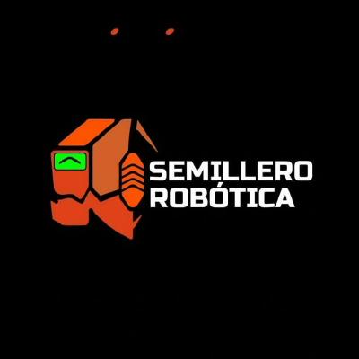

**Semillero de Robótica** · Universidad de Bogotá Jorge Tadeo Lozano

Licensed under [Apache 2.0](LICENSE)
</div>
